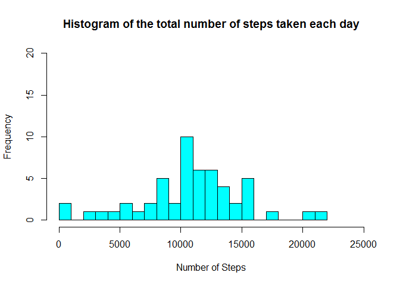
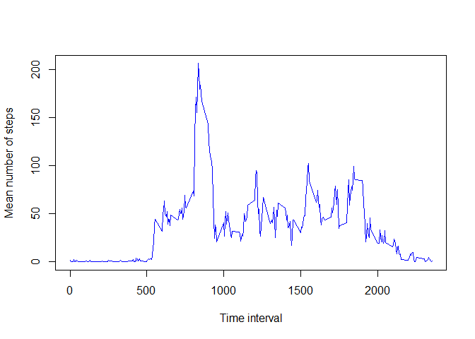
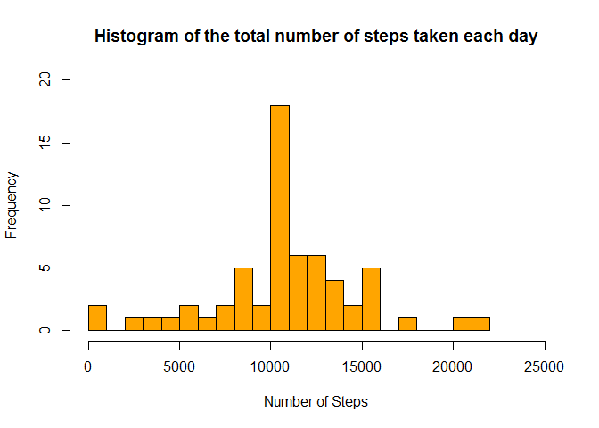
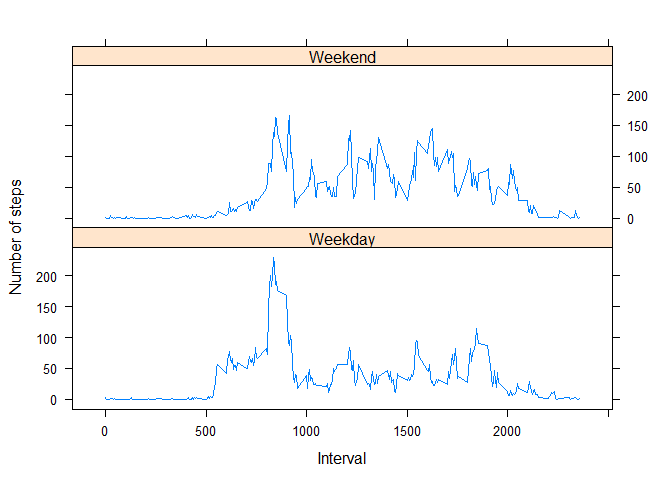

# Reproducible Research: Peer Assessment 1


## Loading and preprocessing the data

This is the code to load the data.

```r
mydata <- read.csv(unz("activity.zip", "activity.csv"))
```

Convert the dates into a usable date format.


```r
mydata$date <- as.Date(as.character(mydata$date), "%Y-%m-%d")
class(mydata$date)
```

```
## [1] "Date"
```


## What is mean total number of steps taken per day?

For this question, we calculate the total number of steps for each day and then take the mean of those values.  I chose the values for the "breaks" and "xlim" parameters to show the data in 1000 step increments.


```r
sumdata<-aggregate(mydata$steps, by = list(mydata$date), sum)
hist(sumdata$x, breaks = 25, main = "Histogram of the total number of steps taken each day", col = "cyan", xlab = "Number of Steps", ylim = c(0, 20), xlim = c(0, 25000))
```

<!-- -->

Mean number of steps each day is:

```r
mean(sumdata$x, na.rm = TRUE)
```

```
## [1] 10766.19
```

Median number of steps each day:

```r
median(sumdata$x, na.rm = TRUE)
```

```
## [1] 10765
```

## What is the average daily activity pattern?

Time series plot of the activities for the average day.


```r
timeseries <- aggregate(mydata$steps, by = list(mydata$interval), mean, na.action = na.omit, na.rm = TRUE)
plot(timeseries$x ~ timeseries$Group.1, type = "l", col = "blue", ylab = "Mean number of steps", xlab = "Time interval")
```

<!-- -->

The maximum mean number of steps is taken during interval number


```r
mydata$interval[which.max(timeseries$x)]
```

```
## [1] 835
```

## Imputing missing values


The number of missing values is:

```r
sum(is.na(mydata$steps))
```

```
## [1] 2304
```

For the NA values, we will use the mean number of steps during the corresponding interval.  Because step counts are integer values, we round the mean number of steps to the closest integer.


```r
names(timeseries) <- c("interval", "meanvalue")
mdata <- merge(mydata, timeseries, by = "interval")
mdata[is.na(mdata$steps), "steps"] <- round(mdata[is.na(mdata$steps), "meanvalue"])
sumdata2<-aggregate(mdata$steps, by = list(mdata$date), sum)
hist(sumdata2$x, breaks = 25, main = "Histogram of the total number of steps taken each day", col = "orange", xlab = "Number of Steps", ylim = c(0, 20), xlim = c(0, 25000))
```

<!-- -->

Mean number of steps each day is:

```r
mean(sumdata2$x, na.rm = TRUE)
```

```
## [1] 10765.64
```

Median number of steps each day:

```r
median(sumdata2$x, na.rm = TRUE)
```

```
## [1] 10762
```

By imputing values in this way, the change in the mean daily number of steps is -0.549335, and the change in the median daily number of steps is -3.  


```r
mean(sumdata2$x, na.rm = TRUE) - mean(sumdata$x, na.rm = TRUE)
```

```
## [1] -0.549335
```


```r
median(sumdata2$x, na.rm = TRUE) - median(sumdata$x, na.rm = TRUE)
```

```
## [1] -3
```

## Are there differences in activity patterns between weekdays and weekends?

Using the dataset with the imputed data, we look to see if there are differences between weekday and weekend activity.  

To do this, we add a factor to the dataset to indicate if the date is a weekday or on a weekend. Then, we average the number of steps per interval per part of the week (weekday or weekend).  Finally, we plot the data.


```r
mdata$weekpart <- as.factor(ifelse((weekdays(mdata$date) == "Saturday" | weekdays(mdata$date) == "Sunday") , "Weekend", "Weekday"))
timeseries3 <- aggregate(mdata$steps, by = list(mdata$interval, mdata$weekpart), mean, na.action = na.omit, na.rm = TRUE)
library(lattice)
names(timeseries3) = c("Interval", "Weekpart", "Mean")
xyplot(timeseries3$Mean ~ timeseries3$Interval | timeseries3$Weekpart, type = "l", layout = c(1,2), xlab = "Interval", ylab = "Number of steps")
```

<!-- -->

The data shows that weekday activity generally starts earlier in the day
